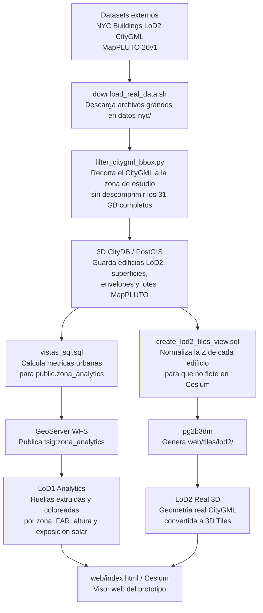

# Lab - Ciudades 3D con CityGML, 3D CityDB, GeoServer y Cesium

Este repositorio contiene un prototipo web para el laboratorio de Bases de Datos para Ciudades 3D.

La idea del caso de estudio es tomar edificios reales LoD2 de NYC, cargarlos en 3D CityDB, cruzarlos con datos de zonificacion de MapPLUTO y mostrar metricas urbanas en un visor web 3D.

## Estado actual

El proyecto esta funcionando con dos modos de visualizacion:

- **LoD1 Analytics:** huellas de edificios extruidas por altura, coloreadas por zona/FAR/altura/exposicion solar.
- **LoD2 Real 3D:** geometria real CityGML convertida a 3D Tiles, con paredes y techos.

En la corrida actual hay:

- `5395` registros en `public.zona_analytics`, que es la capa analitica principal.
- `5392` edificios en `public.v_lod2_buildings_3dtiles`, usados para generar los 3D Tiles LoD2.
- `4086` lotes MapPLUTO cargados en `public.mappluto`.

Los 3D Tiles LoD2 ya fueron regenerados con la Z normalizada: cada edificio se baja a `z=0` antes de exportar, para que no quede flotando sobre el mapa base de Cesium.

## Que se ve en el visor

El visor Cesium muestra edificios sobre OpenStreetMap y permite alternar entre LoD1 y LoD2.

En **LoD1 Analytics** se puede cambiar la simbologia por:

- zona normativa (`zonedist1`);
- posibles violaciones de FAR;
- posibles violaciones de altura;
- exposicion solar aproximada;
- datos del lote al hacer clic sobre un edificio.

En **LoD2 Real 3D** se carga la geometria 3D real derivada del CityGML. Este modo prioriza forma real de edificios; los atributos analiticos se consultan al hacer clic via WFS.

URL local del visor:

```text
http://localhost:8081
```

## Sombra solar 3D

En el panel izquierdo, seccion **Sombra solar 3D**, el visor simula la posicion
real del sol sobre la zona de estudio y proyecta sombras 3D:

- **Activar sombras:** los edificios proyectan sombra real sobre calles y lotes
  vecinos. Se usa modo `CAST_ONLY` (proyectan pero no reciben) porque los GLB
  generados por `pg2b3dm` tienen normales irregulares y, al *recibir* sombra, se
  renderizaban casi negros.
- **Resaltar sol:** pinta los edificios color crema y enciende la iluminacion;
  las caras al sol quedan claras y las caras en sombra oscuras, para ver de un
  vistazo que recibe sol y que no.
- **Fecha:** cualquier dia sirve. La fecha cambia la **altura y el rumbo** del
  sol — `21-jun` (solsticio de verano) da el sol mas alto y sombras cortas,
  `21-dic` da el sol mas bajo y sombras largas, los equinoccios quedan en el
  medio. El huso horario de NYC se ajusta solo (EDT en verano, EST en invierno).
- **Hora local + slider 5–21h** y atajos `12h / 15h / 20h`: mueven el sol por hora.
- **☀ Ir al sol:** ubica la camara en la posicion real del sol a esa fecha/hora
  (efemerides de Cesium), mirando hacia la zona.

Funciona mejor en modo **LoD2 Real 3D** (geometria real con techos y paredes).

## Stack

- `citydb`: PostgreSQL/PostGIS con 3D CityDB 5, SRID `EPSG:32118`.
- `geoserver`: publica vistas PostGIS como WFS.
- `cesium-viewer`: nginx sirviendo `web/index.html`.
- `scripts/filter_citygml_bbox.py`: recorta el CityGML grande antes de importarlo.

Puertos locales:

- Postgres/3D CityDB: `localhost:5432`
- GeoServer: `http://localhost:8080/geoserver`
- Cesium: `http://localhost:8081`

Si `8080` esta ocupado en tu maquina, hay que cambiar el puerto de GeoServer en `docker-compose.yml`, `geoserver-setup.sh` y `web/index.html`.

## Flujo de trabajo actual

El proyecto tiene dos caminos que se complementan: uno analitico, para calcular indicadores urbanos, y otro visual, para mostrar geometria 3D real.



En palabras simples: primero bajamos datos reales, despues nos quedamos solo con una zona manejable, la cargamos en la base 3D, calculamos indicadores con SQL y finalmente publicamos dos tipos de salida para la web. GeoServer sirve la capa analitica consultable, mientras que los 3D Tiles sirven la geometria LoD2 real de forma eficiente para Cesium.

La razon de tener ambos modos es practica. El modo **LoD1 Analytics** es mejor para explicar resultados urbanos porque permite colorear edificios por zona, FAR, altura o exposicion solar. El modo **LoD2 Real 3D** es mejor para mostrar que los datos de origen tienen geometria 3D real, con techos y paredes, aunque no esta pensado para simbolizar todos los indicadores directamente.

## Datos

Los datos grandes no estan versionados en Git. Se descargan en `datos-nyc/`, carpeta ignorada por `.gitignore`.

Fuentes usadas:

- NYC Buildings LoD2 CityGML, publicado como dataset de ejemplo de 3D CityDB/TUM.
- MapPLUTO 26v1, publicado por NYC Planning, para atributos de zoning y FAR.

El CityGML completo viene comprimido en un ZIP de alrededor de 2.46 GB, pero el GML interno pesa mas de 31 GB. Por eso no lo descomprimimos completo: se lee por streaming con `7z` y se genera un recorte espacial chico.

Zona de analisis:

```text
EPSG:32118 bbox = 308000, 60500, 309500, 62000
```

Esa bbox cae en el area Queens/Brooklyn, cerca de Middle Village / Glendale.

## Requisitos

Antes de empezar, instalar:

- Docker Desktop
- `curl`
- `python3`
- `7z` / p7zip
- GDAL, para tener `ogr2ogr`

En macOS con Homebrew:

```bash
brew install p7zip gdal
```

Tambien conviene tener al menos 5 GB libres. No hacen falta 31 GB porque el flujo evita descomprimir el GML completo.

## Instalacion desde cero

Clonar el repo:

```bash
git clone git@github.com:MichelGuerrero04/lab.git
cd lab
```

Levantar servicios:

```bash
docker compose up -d
```

Esto crea Postgres/3D CityDB, GeoServer y el nginx del visor. Al principio todavia no hay datos reales cargados.

### Camino recomendado para la VM de entrega

En la VM de entrega, la docente no deberia instalar nada ni reconstruir datos. El
nombre de la maquina es `TSIGE-Ciudades3D` y las credenciales de Ubuntu son:

```text
usuario: user
password: 1234
```

El flujo esperado es:

```bash
cd ~/lab
./scripts/start_eval.sh
```

Despues puede abrir:

```text
http://localhost:8081
```

Ese comando levanta los servicios, corre una verificacion automatica y deja el
visor listo. La VM debe entregarse previamente preparada con Docker, datos,
volumenes de base/GeoServer y 3D Tiles ya generados. La guia detallada esta en
`docs/entrega-vm.md`.

Descargar datasets:

```bash
./download_real_data.sh
```

Esto descarga:

- `datos-nyc/NYC_Buildings_LoD2_CityGML.zip`
- `datos-nyc/mappluto_26v1_shp.zip`

Importar y publicar todo:

```bash
./import_real_data.sh
```

Este script hace varios pasos porque cada uno tiene una razon:

- genera `datos-nyc/NYC_Buildings_LoD2_bbox.gml`, un CityGML recortado a la bbox del laboratorio;
- importa ese GML en 3D CityDB con `citydb-tool`;
- carga MapPLUTO recortado y reproyectado a `EPSG:32118`;
- ejecuta `vistas_sql.sql` para crear las vistas analiticas;
- ejecuta `create_lod2_tiles_view.sql` para crear la vista LoD2 normalizada;
- regenera `web/tiles/lod2/` con `pg2b3dm`;
- ejecuta `geoserver-setup.sh` para publicar las vistas como capas WFS;
- deja listo el visor web.

Abrir:

```text
http://localhost:8081
```

## Verificaciones

Ver que los contenedores esten vivos:

```bash
docker compose ps
```

Ver cantidad de edificios analiticos:

```bash
docker compose exec -T citydb psql -U postgres -d laboratorio \
  -c "select count(*) from public.zona_analytics;"
```

En la corrida usada para este prototipo, el resultado fue `5395`.

Probar GeoServer/WFS:

```bash
curl "http://localhost:8080/geoserver/tsig/ows?service=WFS&version=2.0.0&request=GetFeature&typeName=tsig:zona_analytics&outputFormat=application%2Fjson&srsName=EPSG:4326&count=1"
```

Si devuelve un `FeatureCollection`, GeoServer esta publicando bien.

Ver que los 3D Tiles LoD2 estan servidos:

```bash
curl "http://localhost:8081/tiles/lod2/tileset.json"
```

El `boundingVolume.region` del tileset actual arranca en `0.0` metros. Esa es la senial de que la Z fue normalizada y los edificios no deberian flotar.

## Ver las queries de simulacion

Las consultas de analisis estan en:

```text
queries_simulacion.sql
```

La forma mas comoda de ejecutarlas es con:

```bash
./scripts/run_queries.sh
```

El script corre todas las queries contra la base `laboratorio`, imprime los resultados en terminal y guarda una copia en:

```text
outputs/queries_simulacion_YYYYMMDD_HHMMSS.txt
```

Los parametros principales se pueden cambiar sin editar el SQL:

```bash
QUERY_LIMIT=10 \
VECINOS_RADIO_M=50 \
DESARROLLO_RADIO_M=40 \
FAR_DISPONIBLE_MIN=0.75 \
AREA_MIN_M2=300 \
CLUSTER_RADIO_M=40 \
OUTLIER_RADIO_M=50 \
./scripts/run_queries.sh
```

Parametros disponibles:

- `QUERY_LIMIT`: cantidad maxima de filas en las queries con ranking.
- `VECINOS_RADIO_M`: radio usado para analisis de entorno en Q4.
- `DESARROLLO_RADIO_M`: radio usado para impacto de nueva construccion en Q9.
- `FAR_DISPONIBLE_MIN`: FAR minimo disponible para considerar potencial de desarrollo.
- `AREA_MIN_M2`: area minima de planta para candidatos de desarrollo.
- `SOLAR_AREA_MIN_M2`: area minima para candidatos solares.
- `HISTORICO_ANIO_MAX`: anio maximo para considerar edificios historicos.
- `CLUSTER_RADIO_M`: radio usado por Q11 para agrupar violaciones cercanas.
- `OUTLIER_RADIO_M`: radio usado por Q12 para comparar altura contra vecinos.
- `OUTLIER_MIN_VECINOS`: cantidad minima de vecinos requerida en Q12.

## Capas y tablas principales

- `citydb.feature`: features CityGML importadas en el esquema 3D CityDB.
- `public.mappluto`: lotes MapPLUTO recortados.
- `public.v_buildings_3d`: edificios importados con altura calculada desde el envelope 3D.
- `public.zona_buildings`: geometria de base de edificios desde `GroundSurface`.
- `public.zona_analytics`: capa principal del visor, con metricas + zoning/FAR.
- `public.zona_roads`: queda vacia en esta version porque solo se importan edificios, no calles CityGML.
- `public.v_lod2_buildings_3dtiles`: vista con la geometria 3D real LoD2; alimenta a `v_lod2_zona_analytics`.
- `public.v_lod2_zona_analytics`: vista que consume `pg2b3dm` para generar los 3D Tiles LoD2 (geometria de `v_lod2_buildings_3dtiles` + atributos de `zona_analytics`).
- `web/tiles/lod2/`: salida estatica de 3D Tiles servida por nginx.

La capa que consume el frontend es:

```text
tsig:zona_analytics
```

Los 3D Tiles que consume el frontend estan en:

```text
/tiles/lod2/tileset.json
```

## Consultas de simulacion

El archivo `queries_simulacion.sql` tiene consultas de zonificacion sobre
`public.zona_analytics`. Ademas de las basicas (resumen por distrito, violaciones
de FAR y altura, potencial de densificacion por lote, etc.) se agregaron:

- **Q10 — Densificacion agregada por distrito:** total de m² construibles
  legalmente por zona (`(FAR_permitido - FAR_construido) * area`) y % de
  subutilizacion promedio.
- **Q11 — Clusters de violaciones (`ST_ClusterDBSCAN`):** agrupa edificios que
  violan FAR o altura cuando hay >=3 dentro de 40 m, para detectar *zonas*
  problematicas en vez de casos sueltos.
- **Q12 — Outliers de altura:** edificios cuya altura supera 2x la mediana de sus
  vecinos a 50 m (rupturas de escala).

Correr todas:

```bash
./scripts/run_queries.sh
```

### Nota: orientacion y exposicion solar

`vistas_sql.sql` calcula `orientacion_fachada` y `exposicion_solar` a partir del
azimut del **eje largo del rectangulo minimo rotado** (`ST_OrientedEnvelope`).
Antes se usaba `ST_Envelope` (caja alineada a los ejes), cuyo primer borde apunta
siempre al Norte, lo que daba un valor constante para todos los edificios.

### Nota: atributos en los 3D Tiles LoD2

El servicio `pg2b3dm-converter` embebe atributos (`-a`) en los tiles
(`zonedist1`, `far_permitido`, `far_construido`, `pluto_yearbuilt`,
`exposicion_solar`, `height`) para poder simbolizar en LoD2. Si se regeneran los
tiles, usar ese servicio (no uno sin `-a`) o el coloreo por atributo en LoD2
queda en gris.

## Mejoras al informe

`TSIG_paper-2.pdf` es el borrador del documento de entrega incluido como contexto del proyecto.
`correcciones_paper.txt` lista correcciones detectadas al cruzar ese documento
contra el codigo y la base (unidades km², versiones de PostgreSQL/PostGIS,
`postgis_sfcgal`, conteos a verificar, etc.). Pensado para pasarselo al autor.

## LoD1 vs LoD2

**LoD1 Analytics** no muestra techos reales. Toma la huella del edificio y la extruye usando la altura calculada desde el envelope 3D. Es el modo mas util para colorear por variables urbanas.

**LoD2 Real 3D** muestra superficies reales del CityGML, incluyendo paredes y techos. Para que funcione bien en Cesium, `create_lod2_tiles_view.sql` resta el `z_min` de cada edificio antes de generar tiles. Sin esa normalizacion, los edificios aparecen flotando porque el CityGML trae cotas absolutas y el mapa base de Cesium usa terreno plano en altura `0`.

## Por que hay un archivo demo

`seed_demo_data.sql` crea una capa sintetica chica de 96 edificios. Sirve solo para probar que Docker, GeoServer y Cesium se comunican.

Para el laboratorio real no usar esa capa como resultado final. El flujo real es:

```bash
./download_real_data.sh
./import_real_data.sh
```

## Repetir desde una base limpia

Si queres borrar la base y empezar de cero:

```bash
docker compose down -v
docker compose up -d
./import_real_data.sh
```

No hace falta volver a ejecutar `download_real_data.sh` si `datos-nyc/` sigue existiendo.

## Problemas comunes

Si `7z` no existe:

```bash
brew install p7zip
```

Si `ogr2ogr` no existe:

```bash
brew install gdal
```

Si `localhost:8080` no responde, esperar unos segundos y revisar:

```bash
docker compose ps
docker compose logs geoserver
```

Si el visor carga pero no muestra edificios, probar primero el WFS con el `curl` de verificacion. Si WFS funciona, refrescar el navegador con cache limpia.

Si el modo LoD2 se ve raro despues de regenerar tiles, refrescar fuerte el navegador (`Cmd + Shift + R`) para evitar que Chrome use archivos `.glb` o `tileset.json` cacheados.

## Notas sobre conteos

La guia original del laboratorio menciona `1597` edificios para una corrida previa. En este repo, el filtro espacial sobre el CityGML real completo produce alrededor de `5395` registros en `zona_analytics`.

La diferencia no significa que sean datos sinteticos: el visor actual usa edificios reales de NYC y lotes reales de MapPLUTO. Simplemente el recorte efectivo incluye mas edificios que la corrida documentada originalmente.
